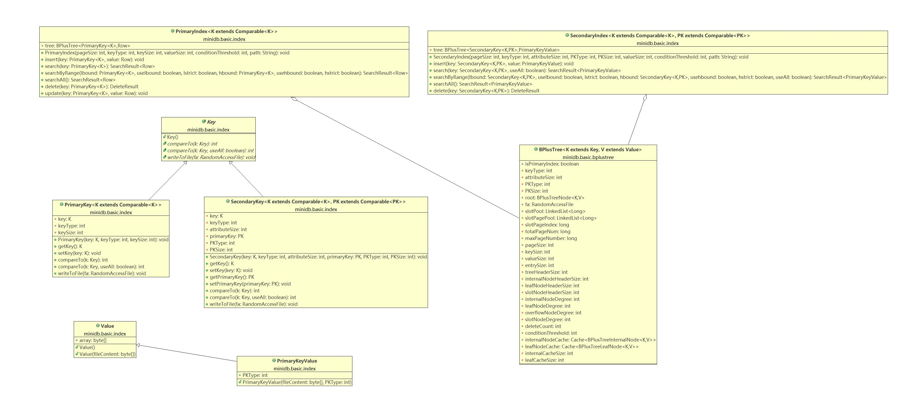

### MiniDB的存储模块

#### 数据的存储机制

##### 1. 基本原理

MiniDB采用**B+树**作为索引，所有数据直接存储在叶节点中。具体实现保证了各个数据的键值各不相同。每一个节点存储在一个**page**中。所有的page都存储在一个文件中，page的大小是一个预先指定好的值。为了避免存储浪费，使用**page pool**技术管理所有page，空闲的page被page pool维护，需要新page时直接取用。page pool的信息被储存到slot page中。

为了节省时间，MiniDB的B+树采用了缓存，对叶节点和内部节点分别维护了缓存。缓存采取了**LRU**的替换机制，采用**write- allocate**和**write-through**的读写策略。

##### 2. 具体实现

+ BPlusTree<K extends Key, V extends Value>类：B+树的实现类
+ BPlusTreeNode<K extends Key, V extends Value>类：节点的实现类
+ BPlusTreeLeafNode<K extends Key, V extends Value> 类：叶节点的实现类
+ BPlusTreeInternalNode<K extends Key, V extends Value>类：内部节点的实现类
+ BPlusTreeSlotNode<K extends Key, V extends Value>类：slot page的实现类
+ BPlusTreeConst类：维护了一些常量
+ BPlusTreeUtils类：B+树的一些通用操作
+ Cache\<T\>类：缓存的实现类

##### 3. 主要类的类图

#### 数据库的索引机制

##### 1. 基本原理

MiniDB支持建立在单个属性上的primary index和secondary index。在创建table时，数据库会为主键创建primary index，为每个非主键的属性创建一个secondary index。每个index都对应于一个B+树，primary index对应的B+树的key是主键值，value是tuple；secondary index对应的B+树的key是**属性值+主键值**，value是**主键值**，这样就保证了键值的唯一性。

##### 2. 具体实现

+ PrimaryIndex<K extends Comparable\<K\>>类：primary index的实现类
+ SecondaryIndex<K extends Comparable\<K\>, PK extends Comparable\<PK\>>类：secondary index的实现类
+ Key类：抽象类，对B+树的键值的封装
+ PrimaryKey<K extends Comparable\<K\>>类：primary index中对主键值的封装
+ SecondaryKey<K extends Comparable\<K\>, PK extends Comparable\<PK\>>类：secondary index中对**属性值+主键值**的封装
+ Value类：对B+树中存储的数据值的封装
+ Row类：primary index中对数据（元组）的实现，也是数据库中对内存和外存中元组的实现
+ PrimaryKeyValue类：secondary index中对数据（主键值）的实现

##### 3. 主要类的类图

#### 元数据存储机制

